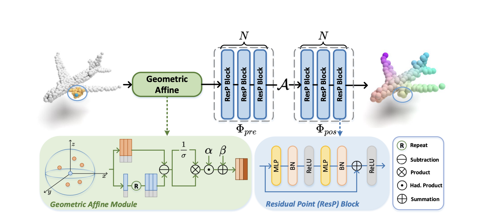
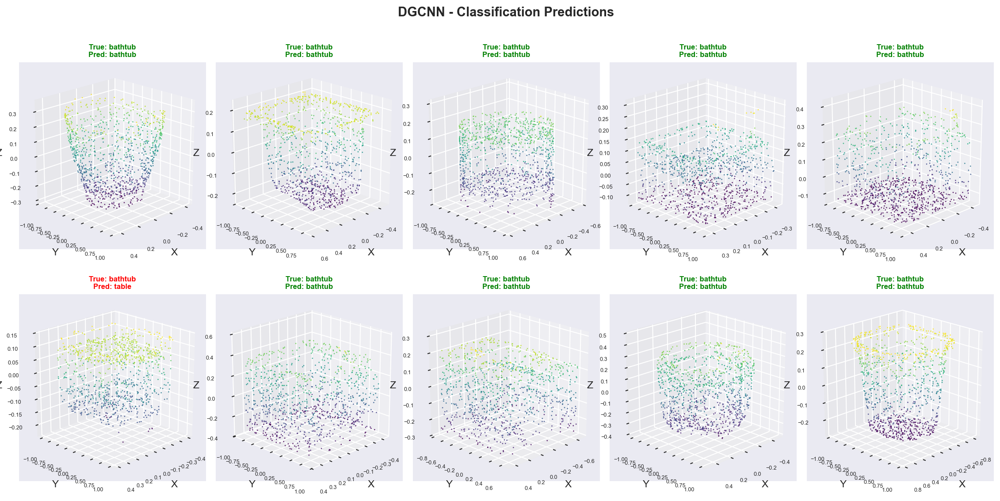
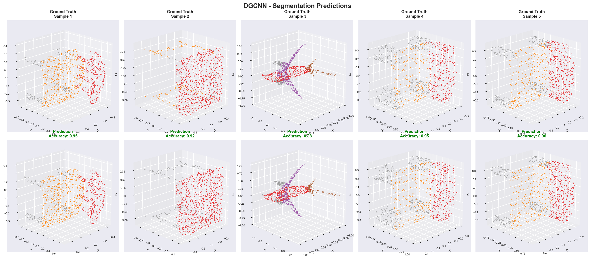

# 3D Scene Understanding
---
A custom reimplementation of 3D deep learning architectures including **PointNet**, **PointNet++**, **DGCNN**, and **PointMLP** for **point cloud classification and segmentation** tasks. This project uses the **ModelNet10** dataset for classification and **ShapeNetPart** dataset for segmentation tasks.
---

## Key Features

- Implementation of **PointNet**, **PointNet++**, **DGCNN**, and **PointMLP** architectures
- Support for **classification** and **segmentation** on 3D point clouds
- Training and evaluation on **ModelNet10** (classification) and **ShapeNetPart** (segmentation) datasets
- Comprehensive benchmarking across all model-task combinations
- TensorBoard logging for training visualization
=======

---

## Architectures

### 🔹 PointNet


> PointNet directly consumes raw point clouds and learns global shape features using shared MLPs and a symmetric function like max pooling to ensure permutation invariance. It is highly efficient and suitable for classification and segmentation but struggles with capturing fine-grained local structures.

### 🔹 PointNet++


> PointNet++ builds upon PointNet by introducing a hierarchical structure that captures both local and global geometric features using a sampling and grouping strategy. It applies PointNet recursively on local neighborhoods, significantly improving performance on complex and non-uniform point cloud data.

### 🔹 DGCNN


> DGCNN (Dynamic Graph CNN) dynamically constructs a local graph for each point and applies edge convolutions to learn features based on relative point relationships. This model effectively captures local geometric context and is particularly strong in tasks requiring spatial awareness like segmentation.

### 🔹 PointMLP


> PointMLP (Point Multi-Layer Perceptron) is a simple yet effective architecture that leverages MLPs for point cloud processing. It applies shared MLPs to each point independently, making it highly efficient and easy to implement. While it may not capture local structures as effectively as other methods, it serves as a strong baseline for point cloud tasks.

---

## Results

### Comprehensive Model Comparison

The following table presents the performance of all implemented architectures on both classification and segmentation tasks:

| Model | Task | Dataset | Test Acc (%) | mIoU (%) | Epochs | Notes |
|-------|------|---------|--------------|----------|---------|-------|
| **PointNet** | Classification | ModelNet10 | 86.56 | - | 20 | Strong baseline performance |
| **PointNet** | Segmentation | ShapeNetPart | 85.3 | 78.7 | 20 | Good global feature learning |
| **PointNet++** | Classification | ModelNet10 | 91.4 | - | 20 | Improved with hierarchical features |
| **PointNet++** | Segmentation | ShapeNetPart | 89.86 | 78.04 | 20 | Best overall segmentation |
| **DGCNN** | Classification | ModelNet10 | 91.29 | - | 20 | Excellent local structure capture |
| **DGCNN** | Segmentation | ShapeNetPart | 91.32 | 80.22 | 20 | Strong spatial awareness |
| **PointMLP** | Classification | ModelNet10 | 79.62 | - | 20 | Efficient baseline approach |
| **PointMLP** | Segmentation | ShapeNetPart | 88.37 | 76.3 | 20 | Simple yet effective |

> **Note**: These results are based on training with 1024 points per sample, batch size 32, and learning rate 0.001. All models were trained for 20 epochs with checkpoints saved every 10 epochs.

### Key Observations

- **DGCNN** achieves the highest classification accuracy (91.29%) on ModelNet10, demonstrating the effectiveness of dynamic graph convolutions
- **DGCNN** also shows the best segmentation performance with 80.22% mIoU on ShapeNetPart, excelling in both tasks
- **PointNet** provides solid baseline performance across both tasks with computational efficiency
- **PointMLP** offers a simple alternative with competitive results, especially for resource-constrained scenarios

### Model Predictions Visualization

Below are sample predictions from **DGCNN**, our best performing model on both tasks:

#### Classification Results


*DGCNN classification predictions on ModelNet10 test samples. Green titles indicate correct predictions, red titles show misclassifications.*

#### Segmentation Results


*DGCNN segmentation predictions on ShapeNetPart test samples. Top row shows ground truth labels, bottom row shows model predictions with point-wise accuracy scores.*

### Training Curves

All training and validation curves are available in the TensorBoard logs located in `assets/checkpoints/runs/`. You can visualize the training progress using:

```bash
tensorboard --logdir assets/checkpoints/runs/
```

### Evaluation

To evaluate saved checkpoints and generate visualizations:

```bash
# Evaluate classification model with visualization
python evaluate.py --checkpoint_path assets/checkpoints/model_classification_final.pth --visualize

# Evaluate segmentation model with visualization  
python evaluate.py --checkpoint_path assets/checkpoints/model_segmentation_final.pth --visualize --seg_data_dir ./ShapeNetPart
```

---

## Prerequisites

```bash
pip install -r requirements.txt
```

## Installation
Clone the repository:
```bash
git clone https://github.com/hamidthri/3d-scene-understanding.git
cd 3d-scene-understanding
```

## Dataset
Download and extract the datasets:

**ModelNet10 (Classification):**
```bash
wget http://3dvision.princeton.edu/projects/2014/3DShapeNets/ModelNet10.zip
unzip ModelNet10.zip
```

**ShapeNetPart (Segmentation):**
```bash
# Download ShapeNetPart dataset
# Follow official instructions from Stanford
```

---

## Usage

### Training

**Classification Tasks:**
```bash
# PointNet classification
python train.py --task cls --model pointnet --epochs 200 --use_tensorboard

# PointNet++ classification
python train.py --task cls --model pointnet++ --epochs 200 --use_tensorboard

# DGCNN classification
python train.py --task cls --model dgcnn --epochs 200 --use_tensorboard

# PointMLP classification
python train.py --task cls --model pointmlp --epochs 200 --use_tensorboard
```

**Segmentation Tasks:**
```bash
# PointNet segmentation
python train.py --task seg --model pointnet --data_dir ./ShapeNetPart --epochs 200 --use_tensorboard

# PointNet++ segmentation
python train.py --task seg --model pointnet++ --data_dir ./ShapeNetPart --epochs 200 --use_tensorboard

# DGCNN segmentation
python train.py --task seg --model dgcnn --data_dir ./ShapeNetPart --epochs 200 --use_tensorboard

# PointMLP segmentation
python train.py --task seg --model pointmlp --data_dir ./ShapeNetPart --epochs 200 --use_tensorboard
```

### Evaluation
```bash
python predict.py --model [model_name] --task [cls/seg] --checkpoint_path [path_to_checkpoint]
```

### Available Arguments

| Argument | Default | Description |
|----------|---------|-------------|
| `--task` | `classification` | Task type: `cls`/`classification` or `seg`/`segmentation` |
| `--model` | `pointnet` | Model: `pointnet`, `pointnet++`, `dgcnn`, `pointmlp` |
| `--epochs` | `20` | Number of training epochs |
| `--batch_size` | `32` | Training batch size |
| `--learning_rate` | `0.001` | Learning rate |
| `--num_points` | `1024` | Number of points per sample |
| `--use_tensorboard` | `False` | Enable TensorBoard logging |
| `--checkpoint_dir` | `assets/checkpoints` | Checkpoint save directory |

---

## References

- [PointNet Paper](https://arxiv.org/abs/1612.00593)
- [PointNet++ Paper](https://arxiv.org/abs/1706.02413)
- [DGCNN Paper](https://arxiv.org/abs/1801.07829)
- [PointMLP Paper](https://arxiv.org/abs/2202.07123)
- [ModelNet Dataset](http://modelnet.cs.princeton.edu/)
- [ShapeNetPart Dataset](https://cs.stanford.edu/~ericyi/project_page/part_annotation/)
