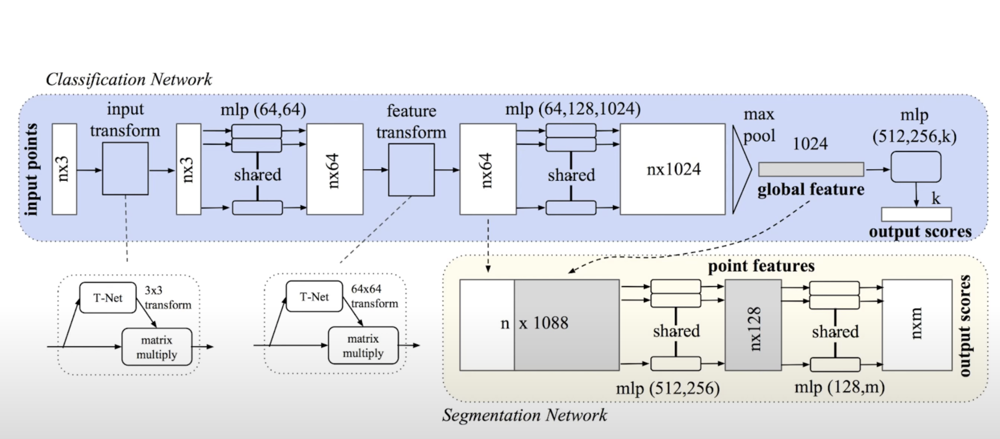
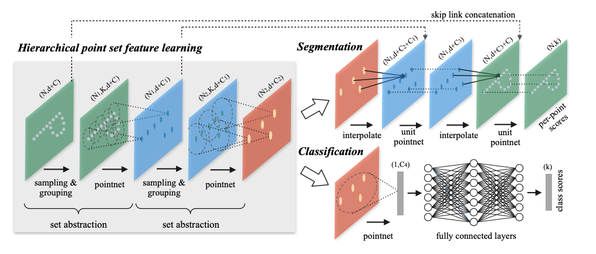
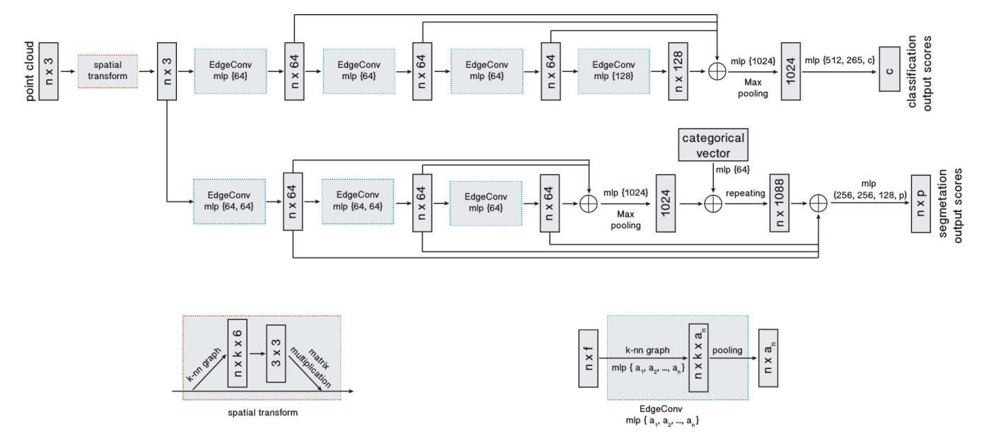
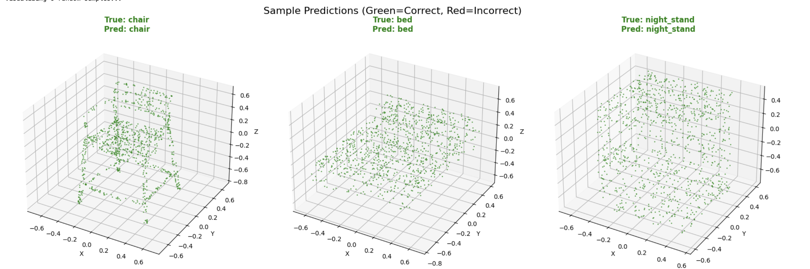

# 3D Scene Understanding

A custom reimplementation of 3D deep learning architectures including **PointNet**, **PointNet++**, and **DGCNN** for **point cloud classification and segmentation** tasks. This project primarily uses the **ModelNet10** dataset to train and evaluate these models on 3D object recognition tasks.

---

## 📌 Key Features

- Implementation of **PointNet**, **PointNet++**, and **DGCNN** architectures.
- Support for **classification** and **segmentation** on 3D point clouds.
- Training and evaluation on the **ModelNet10** dataset.
- Modular codebase for easy extension and experimentation.
- Visualizations for predictions and class-wise performance reports.

---

## 🏗 Architectures

### 🔹 PointNet


> PointNet directly consumes raw point clouds and learns global shape features using shared MLPs and a symmetric function like max pooling to ensure permutation invariance. It is highly efficient and suitable for classification and segmentation but struggles with capturing fine-grained local structures.

### 🔹 PointNet++


> PointNet++ builds upon PointNet by introducing a hierarchical structure that captures both local and global geometric features using a sampling and grouping strategy. It applies PointNet recursively on local neighborhoods, significantly improving performance on complex and non-uniform point cloud data.

### 🔹 DGCNN


> DGCNN (Dynamic Graph CNN) dynamically constructs a local graph for each point and applies edge convolutions to learn features based on relative point relationships. This model effectively captures local geometric context and is particularly strong in tasks requiring spatial awareness like segmentation.

---

## ✅ Prerequisites

Install the required dependencies:

```bash
pip install -r requirements.txt
```

## Installation
Clone the repository:
```bash
git clone https://github.com/hamidthri/3d-scene-understanding.git
cd 3d-scene-understanding
```

## Dataset
Download and extract the ModelNet10 dataset:
```bash
wget http://3dvision.princeton.edu/projects/2014/3DShapeNets/ModelNet10.zip
unzip ModelNet10.zip
```


## Usage

Train Model:
```bash
# Default (PointNet on ModelNet10)
python train.py

# With custom options
python train.py --model pointnet --epochs 100 --batch_size 16 --learning_rate 0.01
# Pointnet++ model
python train.py --model pointnet++
```

Evaluate Model:
```bash
python predict.py
```

## Results

The PointNet model was evaluated on the **ModelNet10** test set, consisting of 908 samples across 10 object categories. The classification report below summarizes precision, recall, and F1-score per class after 10 epochs:

### Classification Report

| Class       | Precision | Recall | F1-score | Support |
|-------------|-----------|--------|----------|---------|
| Bathtub     | 0.98      | 0.88   | 0.93     | 50      |
| Bed         | 0.97      | 0.95   | 0.96     | 100     |
| Chair       | 0.99      | 0.99   | 0.99     | 100     |
| Desk        | 0.62      | 0.88   | 0.73     | 86      |
| Dresser     | 0.50      | 0.34   | 0.40     | 86      |
| Monitor     | 0.99      | 0.96   | 0.97     | 100     |
| Night Stand | 0.89      | 0.48   | 0.62     | 86      |
| Sofa        | 0.95      | 0.99   | 0.97     | 100     |
| Table       | 0.90      | 0.65   | 0.76     | 100     |
| Toilet      | 0.60      | 0.99   | 0.75     | 100     |

- **Overall accuracy:** 82%  
- **Macro average F1-score:** 81%

The model performs very well on classes like **chair**, **bed**, and **monitor**, while performance on **dresser** and **night_stand** is lower, likely due to fewer distinctive features or less training data.

### Example Prediction

Below is a visualization of a sample point cloud from the test set alongside its predicted class label:



*Visualization shows the point cloud colored by predicted class confidence.*


---

## 📚 References

- [PointNet Paper](https://arxiv.org/abs/1612.00593)
- [PointNet++ Paper](https://arxiv.org/abs/1706.02413)
- [DGCNN Paper](https://arxiv.org/abs/1801.07829)
- [ModelNet Dataset: 3D ShapeNets](http://modelnet.cs.princeton.edu/)

